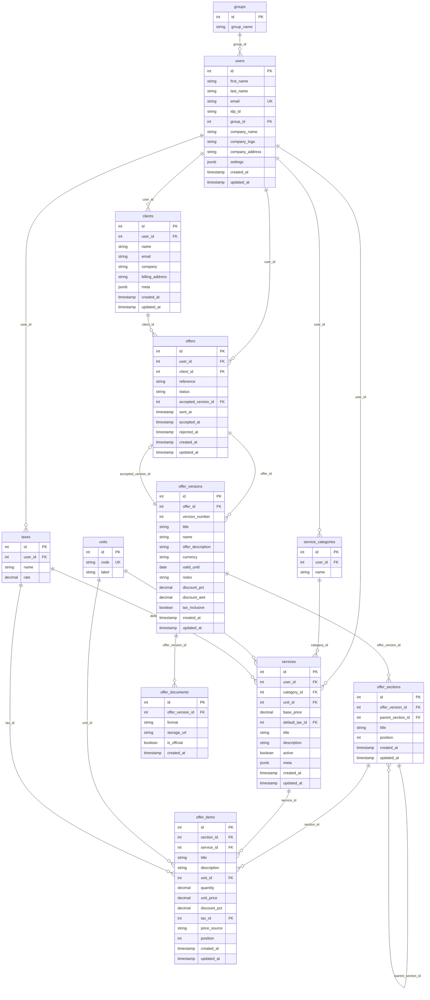

# Offer Backend Schema Diagram

This diagram is based on `offer-backend/src/main/resources/init.sql`.

## Mermaid ER Diagram

## Reading Guide

### 1. Identity / ownership

- `groups` groups users.
- `users` is the main owner table.
- Most business data belongs to one user.

### 2. Catalog data

- `service_categories` stores categories like design, consulting, etc.
- `services` stores reusable services a user can offer.
- `units` stores units such as hour, day, item.
- `taxes` stores reusable tax definitions.

### 3. Offer structure

- `offers` is the top-level commercial document.
- `offer_versions` stores versions/snapshots of one offer.
- `offer_sections` structures a version into sections/subsections.
- `offer_items` stores the priced rows inside sections.
- `offer_documents` stores generated outputs (for example PDFs).

### 4. Important relationship flow

The main business flow is:

`users` -> `services` / `clients` -> `offers` -> `offer_versions` -> `offer_sections` -> `offer_items`

### 5. Special cases to notice

- `offers.accepted_version_id` points to the chosen final row in `offer_versions`.
- `offer_sections.parent_section_id` is a self-reference, which means a section can contain child sections.
- `offer_items.service_id` is optional in practice for linking an item back to a reusable service.

## Quick Mental Map

- **User owns data**
- **Catalog prepares reusable business objects**
- **Offer stores the customer-facing document**
- **Version freezes one state of the offer**
- **Section organizes content**
- **Item stores price lines**

